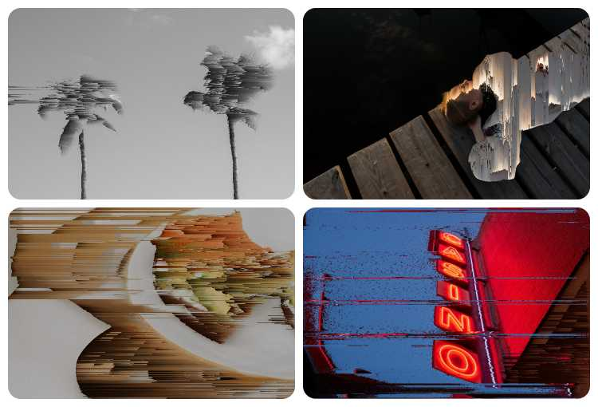

# Pixel Sort

Applies a pixel sorted glitch effect to images.

An image is loaded into an HTML Canvas element. The user can adjust various parameters, and then click the Sort button to apply the effect. The sorted image can be saved to the users local drive. A new, unsorted image can be loaded by clicking the Refresh button.

- Fully typed
- Separation of concerns: the logic for prepping and sorting the pixel data is separated from the display components (see the /funcs folder).

## Accessibility

Pixel Sort can be controlled solely with the keyboard, is fully responsive for mobile and desktop screens, and can be toggled between light and dark display modes.

## Challenge—Slow API

The Unsplash API, used to load a new image when the Refresh button is pressed, can be quite slow at times leading to long waits and bad user experience.

### Solution

I created a second, hidden Canvas element on the page. While the user is playing with the image on the screen, an API call is sent out in the background. The newly retrieved image is placed on the hidden canvas and the ImageData object from this canvas is cached to a variable. When the user clicks the Refresh button, the cached ImageData is immediately swapped into the visible canvas, eliminating any delay and creating a crisp user experience.
